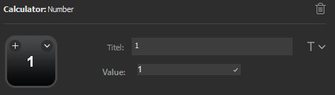

# Calculator for Elgato Stream Deck

## Features

* Saves result in a text file, which can be imported into OBS
* Configurable number buttons (e.g. 0-9 or multi digit numbers)
* Operations (integer or floating point)
  * Addition
  * Subtraction
* Display result on a Stream Deck button
* Set result to custom value
* Clear calculator input to start over
* Stream Deck actions

## Stream Deck buttons

### Operations

There are two operation buttons: Addition und Subtraction

Each calculation starts with an operation and there can only be one operation in a calculation.

### Number

The number button is used to input a number into the current calculation.

### Operation: Calculate

Pressing the calculate button will perform the current calculation.
After that, the input and set operation is cleared.

### Decimal point

Used for floating point calculations. Can be used once per calculation.

### Set

The value of this button can be freely configured, similarly to number buttons.
Pressing this button will set the current result to this value.

### Reset

Pressing this button will reset the selected operation and clear the input.

### Result

This is a widget that will display the current result.

## Installation

Just download the latest file from [Releases](https://github.com/saitho/streamdeck-calculator/releases) and open the file with Stream Deck.

## Configuration

Place as many "Number" buttons as you like and assign a title and a value.
In the example above, I placed 10 for 0-9.

Then also place the operations you need, and the equals (`[=]`) button.
There's also a widget for displaying the current result.

On smaller Stream Decks you may want to use folders to access less-needed functionalities.

## Usage

If you want to do a calculation, press the operation first, then the number, and then the orange "equals" button.

Example: You want to add 15 to the current result.
Press: `[+]` `[1]` `[5]` `[=]`

Example: You want to subtract 500 from the current result.
Press: `[-]` `[5]` `[0]` `[0]` `[=]`

Pressing `[=]` will update the current result in `%appdata%\Elgato\StreamDeck\Plugins\com.saitho.calculator.sdPlugin\_data\result.txt`.

**Note:** You MUST always start with an operation (i.e. `[+]` or `[-]`).

## Integration with OBS

The text files written by this Stream Deck plugin can be accessed by OBS.

1. Open OBS Studio and add a new "Text (GDI+)" source to your scene.
2. In source properties, check the "Read from file" checkbox between font settings and text input.
3. Select the file at `%appdata%\Elgato\StreamDeck\Plugins\com.saitho.calculator.sdPlugin\_data\result.txt`
4. You're done. Try doing some calculations on your Stream Deck. They should be updated shortly after pressing `[=]`.